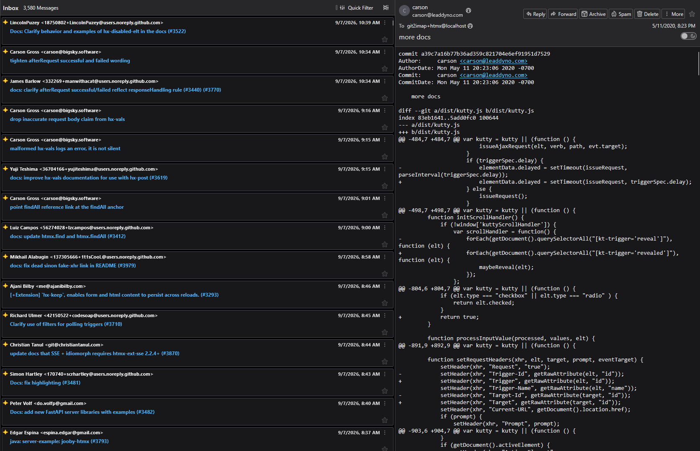

# git2imap

Have you ever wanted to view a git repo's entire commit history from your email client? **Of course you didn't!** Luckily now there's a solution for this burning, age old problem! Introducing git2imap!



git2imap presents hosted Git repositories as read-only IMAP accounts. Each branch is a mailbox and each commit is an email whose body contains the Git patch. I'm using it to make sure the interns don't do anything stupid while I'm flying but too broke to pay for the premium airline internet plans. It also serves as a horrible method of bypassing nation-state firewalls that decided GitHub was too dangerous to be publicly available. Will gi2imap help you? Who knows, but I'm publishing it anyways!

## Current capabilities

- Bare mirror clones for public HTTP(S), authenticated HTTP(S), and SSH remotes
- Default branch as `INBOX`; other branches are below `Branches/`
- Admin web UI for adding, refreshing, inspecting, rotating credentials, and deleting proxies
- It (probably) doesn't blow up now

## Limitations
- Can take a long time to synchronize your mail client on large repos (e.g. Linux.git)
- No repo write support (yet, I'm working on an email-to-commit translation layer)

## Requirements

- Go 1.27 or newer to build
- Git CLI
- OpenSSH client for SSH remotes
- A persistent 32-byte encryption key

## Run locally

Create a configuration from `config.example.yaml`, then supply its two required secrets:

```sh
cp config.example.yaml config.yaml
GIT2IMAP_MASTER_KEY = "<base64-32-byte-key>"
GIT2IMAP_ADMIN_PASSWORD = "<strong-password>"
go run ./cmd/git2imap serve -config config.yaml
```

Open `http://127.0.0.1:8080`, sign in as `admin`, and add a repository.

## Mail client setup

Use:

```text
Email:    git2imap+<project>@<public_host>
Username: git2imap+<project>@<public_host>
Password: generated repository password
IMAP:     configured IMAP or IMAPS listener
SMTP:     configured SMTP or SMTPS listener
```

## Docker

The included Compose file can be used for a local development setup:

```sh
GIT2IMAP_MASTER_KEY = "<base64-32-byte-key>"
GIT2IMAP_ADMIN_PASSWORD = "<strong-password>"
docker compose up --build
```

For production (why on earth would you do this), replace the development listener settings with TLS certificate paths, publish the standard ports you need, mount certificates read-only, set `public_host`, and set both `allow_insecure_auth` values to `false`.

## Security notes

- Keep the master key stable and backed up. Losing it makes stored Git and mail credentials unrecoverable.
- SSH host keys use trust on first use and are persisted in `known_hosts`.
- Repository URLs cannot use local paths, `file://`, or external command transports.
